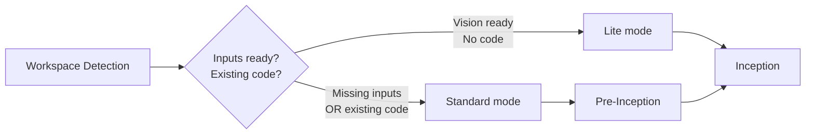
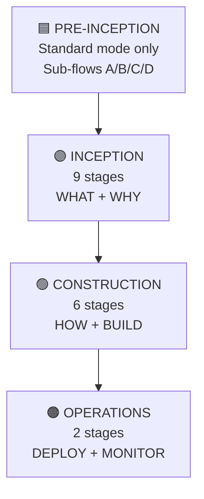
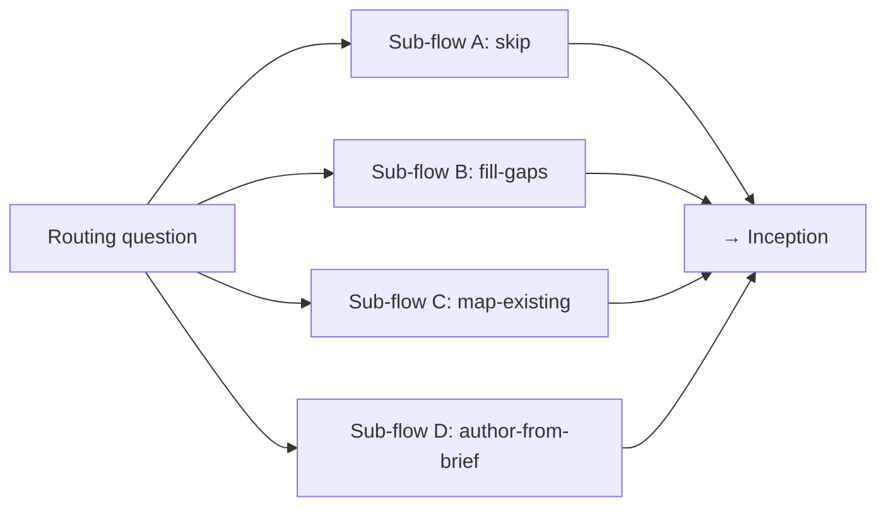
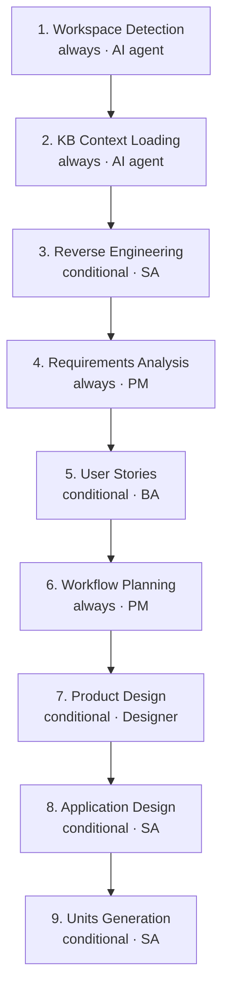
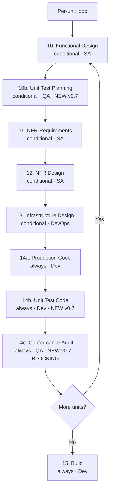
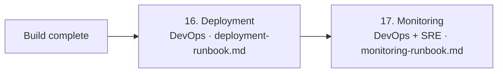

# KAFI AI-DLC Workflow

**v0.9.1 · KAFI Transformation Office**

> This file is Claude Code's project memory. It defines the AI-Driven Development Lifecycle for this KAFI project. When the user requests development work, follow this workflow FIRST.

---

## Two Modes (Auto-Detected)



| | Lite | Standard |
|---|---|---|
| When | Greenfield + clean Vision | Brownfield OR needs input prep |
| Pre-Inception | skipped | runs |
| Reverse Engineering | skipped | runs (brownfield only) |

User can override mode at any time.

---

## Phase Map



**Stage count:** 17 (+ Pre-Inception sub-flow when Standard mode). **Always-on:** 6. **Conditional:** 9. **Placeholder:** 2.

---

## Source-of-Truth Hierarchy

1. **Project KB** — `00-knowledge/` — canonical architecture, glossary, open items, phases, conventions
2. **Vision + Tech Env** — `aidlc-docs/inception/discovery/` — what we're building, on what stack
3. **Product requirements** — `00-knowledge/product/` — BRD/PRD/business reqs
4. **Derived views** — scope, roadmap, presentations — must align to 1–3
5. **Working data** — plans, samples, research

**Rule:** if a user statement contradicts the KB, surface the conflict. Never silently override.

---

## MANDATORY Loading

At workflow start, load:

| What | From | When |
|---|---|---|
| Common rules | `aidlc-rule-details/common/*.md` | Always |
| Active extensions | `aidlc-rule-details/extensions/` | Per trigger |
| KB context | `00-knowledge/` per `context-pins.md` | Always |
| Welcome message | `common/welcome-message.md` | Once per session |

**Common rule files:**
- `process-overview.md` · `session-continuity.md` · `content-validation.md`
- `question-format-guide.md` · `ai-review-checklist.md`

**Extensions:**

| Extension | Category | Status | Trigger |
|---|---|---|---|
| `audit-trail` | KAFI-wide | Always enforced | Any operational system |
| `personal-data-privacy` | KAFI-wide | Opt-in | Auto on PII |
| `architecture-boundaries` | Project | Always if defined | Project supplies YAML |
| `naming-conventions` | Project | Always if defined | Project supplies YAML |
| `phase-discipline` | Project | Always if defined | Project supplies YAML |
| `open-items-protocol` | Project | Always if defined | Project supplies register |

---

## 🟦 PRE-INCEPTION (Standard mode only)



**Routing question** (one multi-choice question, answer with `[Answer]:` tag):

```
A) skip                — Vision + Tech Env ready; proceed
B) fill-gaps           — have one, need the other
C) map-existing        — have legacy BRD/PRD, need to validate + map
D) author-from-brief   — have only intent/brief, need to author
```

Plus two utilities:
- **Entry Router** — `pre-inception/entry-router.md` — 3 questions if intent unclear
- **Document Validator** — `pre-inception/document-validator.md` — consent-first classifier

See `aidlc-rule-details/pre-inception/*.md` for sub-flow details.

---

## 🟣 INCEPTION (9 stages)



Each stage: load `inception/<stage>.md`, execute, append `audit.md`, present completion with 2-option gate ("Request Changes" / "Continue").

---

## 🟢 CONSTRUCTION (6 stages 10–15 — per-unit loop, then build · Stage 14 splits into 14a/14b/14c, plus conditional 10b) · v0.7+v0.8



**NFR = Non-Functional Requirements** (performance, scalability, availability, security, observability, accessibility).

**v0.7+v0.8 conformance model:** Stage 14 split into 14a/14b/14c — Dev produces production code + test code; QA audits **5 sub-checks** (code · token discipline · UI fidelity · test code coverage · **flow conformance**) as the **blocking** gate before the unit advances. Flow conformance (v0.8) verifies code call paths match the Mermaid sequences in `user-flows.md` (Stage 7) + `code-flow.md` (Stage 10). Test execution remains the project's CI/local choice (outside AI-DLC).

---

## 🟠 OPERATIONS (v0.8 formalized)



Stage 16 produces `deployment-runbook.md` (prereqs · ordered steps · migrations · smoke verify · rollback). Stage 17 produces `monitoring-runbook.md` (SLIs/SLOs from NFR thresholds · dashboards · alerts · oncall playbooks · escalation) + `postmortem.md` after incidents. No longer placeholders.

---

## Roles

| Role | Drives | Skill |
|---|---|---|
| PM (Product Owner) | Stages 4, 6 | `kafi-roles/pm.md` |
| BA (Business Analyst) | Stage 5 + Pre-Inception | `kafi-roles/ba.md` |
| SA (Solution Architect) | Stages 3, 8, 9, 10, 11, 12 | `kafi-roles/sa.md` |
| Designer (Product Designer) | Stage 7 | `kafi-roles/designer.md` + `skills/kafi-design-system/SKILL.md` |
| Dev (Developer) | Stages 14a, 14b, 15 | `kafi-roles/dev.md` |
| **QA (Quality Assurance)** | **Stages 10b, 14c (NEW v0.7)** | `kafi-roles/qa.md` |
| DevOps / SRE | Stages 13, 16, 17 | `kafi-roles/devops.md` |
| AI Agent | Every stage | — |

Manual skill inclusion — load when driving a stage. Two skills are auto-discoverable (proper SKILL.md format) and load automatically when their description matches the user's intent:

- **kafi-design-system** — loads whenever a stage produces UI artifacts
- **kafi-aidlc-onboarding** — loads when the user just unzipped the package, asks where to start, mentions `/init`, or wants to scan `00-knowledge/` to determine which AI-DLC stage their project is at. Explains why `/init` is redundant on AI-DLC projects (CLAUDE.md is already auto-loaded).

### Helper skills (v0.8)

Construction-phase helper skills (load when relevant):

- **kafi-doc-sync** — regenerate `aidlc-docs/` code summaries to match current `src/` (run before Stage 14c so the audit checks current docs)
- **kafi-verification-loop** — one-pass build · typecheck · lint · tests · security; Dev runs before handing off to Stage 14c
- **kafi-code-review** — router that detects language per file and dispatches to a per-language reviewer; powers Stage 14c sub-check 1 (Code audit)
  - language reviewers: **kafi-code-review-{typescript · python · go · java · kotlin · cpp · rust · csharp · database · shell}**
- **kafi-memory** — long-term learning; mines git history + postmortems for recurring patterns and surfaces candidate skills/ADRs/checklist-items (human-curated, read-only)

---

## Templates

KAFI standard at `aidlc-rule-details/templates/` · **grouped into 5 phase subfolders** · Project overrides at `00-knowledge/templates/`. Reference a template by its full path, e.g. `templates/01-inception-requirements/pm/prd.md`.

Available templates (34), by phase folder:
- **`00-pre-inception/`** — `brief.md` · `vision.md` · `technical-environment.md` · `glossary.md` · `personas.md` · `risk-register.md`
- **`01-inception-requirements/`** — `pm/` (`prd.md` · `requirements.md`) · `ba/` (`epic.md` · `user-story.md` · `story-map.md`)
- **`02-inception-design/`** — `ui-ux/` (`design-tokens.md` · `uiux-spec.md` · `view-model.md` · `user-flows.md` · `mockup-index.md` · `design-lite.md`) · `architecture/` (`application-design.md` · `data-model.md` · `api-spec.md` · `components.md` · `unit-of-work.md`)
- **`03-construction/`** — `design/` (`functional-design.md` · `code-flow.md` · `nfr-requirements.md` · `nfr-design.md` · `adr.md`) · `test/` (`test-plan.md` · `test-cases.md` · `dod.md`)
- **`04-operations/`** — `deployment-runbook.md` · `monitoring-runbook.md` · `release-notes.md` · `postmortem.md`

**Traceability:** `Intent → Brief → Vision → [BRD] → PRD → REQ → ENT → Epic → Story → Unit → TC → ADR` · IDs: `PRD-NN · REQ-NN · ENT-NN · EPIC-NN · US-NN · UNIT-NN · TC-NN · ADR-NN`

> **PRD vs Requirements:** PRD answers *WHAT* and *FOR WHOM* (product narrative, feature-level, PM-owned). `requirements.md` answers *HOW THE SYSTEM MUST BEHAVE* (testable functional + NFR, derived from PRD-NN). Both produced at Stage 4. See `aidlc-rule-details/templates/01-inception-requirements/pm/prd.md`.

> **v0.7 templates:** `design-tokens.md` · `uiux-spec.md` · `view-model.md` · `data-model.md` · `test-plan.md` · `test-cases.md` · `dod.md`.
> **v0.8 templates (new):** `code-flow.md` (per-unit Mermaid call sequences) · `glossary.md` (bilingual terms) · `api-spec.md` (REST/GraphQL contracts) · `deployment-runbook.md` (Stage 16) · `monitoring-runbook.md` (Stage 17) · `brief.md` (pre-Vision) · `release-notes.md` · `postmortem.md` · `epic.md` · `personas.md` · `risk-register.md` · `design-lite.md` · `story-map.md`.

> **No pending templates** — all previously-pending scaffolds shipped in v0.8.

---

## AI Review Checklist (Soft Enforcement)

Before any meaningful write, agent self-checks against `common/ai-review-checklist.md`. Warnings reported in completion summary — user decides.

**Critical:** Grounded · No secrets · Scope respected · Reversible · Human-decidable
**Risk-shaped:** Auth/money/PII/external/IaC → flag for dual review

---

## Key Principles

- **Adaptive:** only execute stages that add value
- **Transparent:** show plan before starting
- **User control:** stage inclusion/exclusion/override
- **KB precedence:** project KB beats every other source
- **Open items discipline:** never fabricate; emit `Open — pending [owner]`
- **Compliance non-negotiable:** KAFI-wide extensions are not optional
- **Audit trail:** every input + response, ISO 8601, complete raw, append-only
- **Standardized completion:** 2-option only ("Request Changes" / "Continue")

---

## Folder Structure

```
project-root/
├── CLAUDE.md                       # this file
├── aidlc-rule-details/            # rule files
├── .claude/
│   ├── kafi-roles/                 # 7 role guides (pm·ba·sa·designer·dev·qa·devops) — NOT skills
│   ├── skills/                     # 16 kafi-* skills (flat — folder name == skill name)
│   │   ├── kafi-design-system/     # KAFI brand-level design system (SKILL.md)
│   │   ├── kafi-aidlc-onboarding/  # onboarding (+ prompts/)
│   │   └── kafi-*/                 # doc-sync·verification-loop·memory·code-review (+10 langs)
│   ├── hooks/                      # optional
│   └── settings.json
├── 00-knowledge/                   # project KB + conventions
├── aidlc-docs/                     # generated artifacts
├── adrs/                           # Architecture Decision Records
└── src/                            # application code
```

**Rules:**
- Application code: `src/` (NEVER inside `aidlc-docs/`)
- Documentation: `aidlc-docs/` only
- KB: `00-knowledge/` (read-only during workflow)
- ADRs: separate `adrs/` directory

---

## Audit Log Format

```markdown
## [Stage]
**Timestamp:** [ISO 8601]
**User Input:** "[Complete raw input]"
**AI Response:** "[Action taken]"
**Context:** [Stage, decision]
**KB Citations:** [list]
**Open Items:** [list]
**Extensions:** [compliance summary]
**AI Review:** [pass/warnings]
---
```

**Append-only. Never overwrite.**

---

*Companion handbook: `KAFI-AIDLC-Handbook.html` · v0.9.1 · Transformation Office, Kafi Securities*
