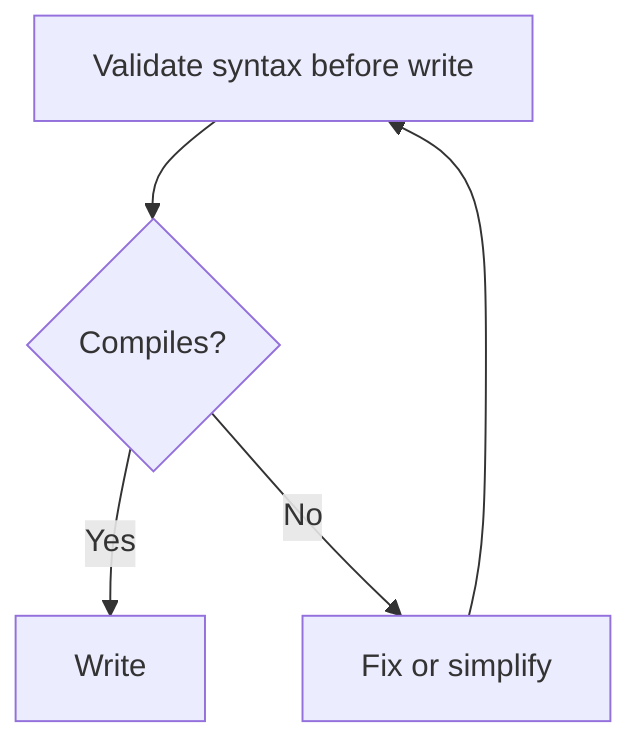

# Content Validation

**Before creating ANY file, validate.**

## Markdown

- Headers properly nested (no skipping h2 → h4)
- Code blocks closed
- Tables have header row + alignment row
- Lists consistent (all `-` or all `*`, not mixed)

## Mermaid diagrams



**Common Mermaid errors:**
- Missing quotes on labels with special chars
- Unclosed brackets in node IDs
- Special chars in IDs (use `<br/>` for line breaks, not `\n`)
- Conflicting directional keywords

## ASCII diagrams

If Mermaid won't render in target context, use simple ASCII:
```
┌─────────┐    ┌─────────┐
│ Input   │ →  │ Output  │
└─────────┘    └─────────┘
```

## Special characters

- Escape backticks in code with backslash
- Escape pipes in tables: `\|`
- Use HTML entities only when necessary

## File paths

- Always relative to project root or rule-detail dir
- Use forward slashes (works on Windows + Unix)
- Never absolute paths

## Citation format

When citing KB:
```
[KB §3.2 architecture/treasury.md#real-time-balance]
```

When citing requirements:
```
[REQ-12 from requirements.md]
```
