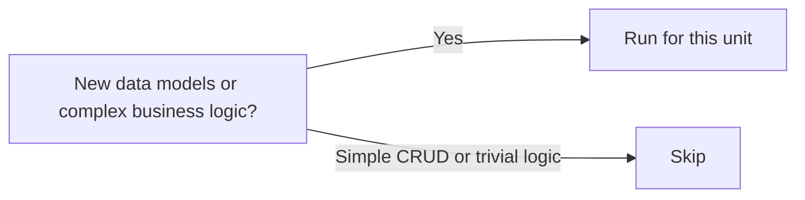

# Stage 10: Functional Design

**Owner:** Solution Architect (SA, sole) · **Conditional** (per-unit) · **Approval required**

## When to run / skip



## Purpose

Detail business logic, rules, and domain entities for one unit. Bridges Application Design → Code Generation.

## Inputs

- `aidlc-docs/inception/application-design/` (incl. **`data-model.md`** — ENT-NN reference)
- `aidlc-docs/inception/user-stories/stories.md` (filtered to this unit's stories)
- `aidlc-docs/inception/product-design/mockups/` — HTML mockups for this unit's screens (if UI)
- `aidlc-docs/inception/product-design/mockups/<screen>.view-model.md` — data binding contract per screen (if UI)
- `aidlc-docs/inception/product-design/interaction-specs.md` (if UI)

## Outputs

To `aidlc-docs/construction/{unit}/functional-design/`:

| File | Content |
|---|---|
| `business-logic-model.md` | Algorithms, flows, calculations |
| `business-rules.md` | Validation rules, decision tables |
| `domain-entities.md` | **Derived from `application-design/data-model.md`** · per-unit view citing ENT-NN it implements · entity definitions, relationships, invariants for this unit's scope. No new entities here unless approved as scope expansion. |
| `frontend-components.md` | UI component hierarchy + props + state, **each component citing its source mockup (`mockups/<screen>.html`)** (if UI) |
| `code-flow.md` | **Mermaid `sequenceDiagram` of the function-call path for each user action in this unit** (use `templates/code-flow.md`). Derives from `user-flows.md` (Stage 7) + business-logic-model + `components.md`. Declares cross-boundary calls (each backed by an ADR). Stage 14c sub-check #5 audits code's actual call paths against this. |

## Steps

1. For each story in this unit:
   - Extract business logic into `business-logic-model.md`.
   - Capture rules in `business-rules.md` as decision tables.
   - Refine domain entities from Application Design.
2. If UI: detail frontend component hierarchy with props, local state, events — **each component mapped to its source mockup file** so Stage 14 can reproduce it faithfully.
3. **Author `code-flow.md`** — for each user action this unit implements, draw the Mermaid `sequenceDiagram` of the code call path (View → Handler → Service → Repo → DB / external). One sequence per happy path + one per error/edge path. List every cross-boundary call + its ADR. This is the contract Stage 14c flow-conformance audit checks the generated code against.
4. Run extension compliance summary.
5. Log open items.

## Approval gate

```
Functional Design for UNIT-{N} complete.
- Business rules captured: [K]
- Domain entities: [J]
- Open items: [list]

→ Request Changes
→ Continue to Stage 11 (NFR Requirements)
```
