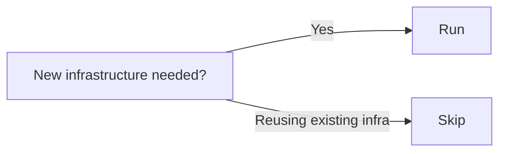

# Stage 13: Infrastructure Design

**Owner:** DevOps · **Conditional** (per-unit) · **Approval required**

## When to run / skip



## Purpose

Map logical components from NFR Design to concrete infrastructure (cloud services or on-prem).

## Inputs

- `nfr-design.md` (this unit)
- `aidlc-docs/inception/discovery/technical-environment.md` (cloud target, constraints)

## Steps

1. For each logical component, choose concrete service:
   - Cache (logical) → Redis on ElastiCache | Redis on K8s | Memcached
   - Queue (logical) → SQS | SNS+SQS | Kafka MSK | RabbitMQ
   - DB (logical) → RDS Postgres | Aurora | DynamoDB
2. Define deployment topology:
   - Networking (VPC, subnets, security groups)
   - Scaling (autoscaling rules, instance types)
   - High availability (multi-AZ, failover)
3. Identify shared infrastructure (cross-unit components).

## Outputs

To `aidlc-docs/construction/{unit}/infrastructure-design/`:

| File | Content |
|---|---|
| `infrastructure-design.md` | Concrete cloud service mappings |
| `deployment-architecture.md` | Topology, networking, scaling, HA |

## Approval gate

```
Infrastructure Design for UNIT-{N} complete.
- Cloud services chosen: [list]
- Shared infrastructure: [list]
- ADRs: [list]

→ Request Changes
→ Continue to Stage 14 (Code Generation)
```

## Open items

If cloud target is undecided (KAFI's W2 open item):
```
Open — pending An/ITS + BTS. See 00-knowledge/open-items.md#cloud-target
```
Use logical components only until decided.
