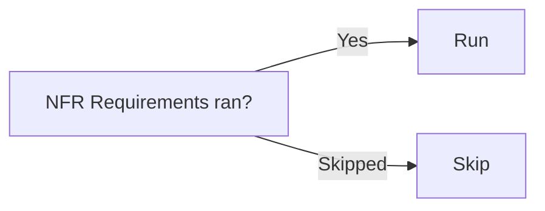

# Stage 12: NFR Design

**Owner:** Solution Architect (SA) · **Conditional** (when NFR Requirements ran) · **Approval required**

## When to run / skip



## Purpose

Select patterns and logical components to meet each NFR threshold.

## Steps

1. Load `nfr-requirements.md` for this unit.
2. For each NFR, select a pattern:
   - Performance: caching, indexing, query optimization
   - Scalability: horizontal scaling, sharding, queueing
   - Availability: circuit breaker, retry, fallback, redundancy
   - Security: encryption (at rest + transit), authn/authz patterns
   - Observability: structured logging, metrics, traces, alerts
3. Identify logical infrastructure components:
   - Cache (Redis, Memcached)
   - Queue (SQS, Kafka, RabbitMQ)
   - Database (relational, key-value, document)
   - CDN, load balancer
4. Open ADRs for non-obvious choices.

## Outputs

To `aidlc-docs/construction/{unit}/nfr-design/`:

| File | Content |
|---|---|
| `nfr-design-patterns.md` | Pattern selection per NFR |
| `logical-components.md` | Logical infra components (cache, queue, etc.) |

## Approval gate

```
NFR Design for UNIT-{N} complete.
- Patterns selected: [list]
- Logical components: [list]
- ADRs: [list]

→ Request Changes
→ Continue to Stage 13 (Infrastructure Design)
```
