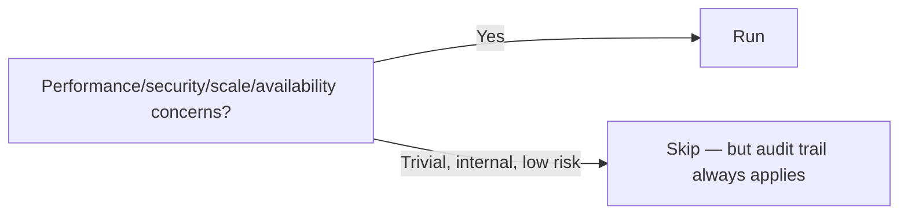

# Stage 11: NFR Requirements

**Owner:** Solution Architect (SA) · **Conditional** (per-unit) · **Approval required**

## What is NFR?

**Non-Functional Requirements** — how well the system behaves, not what it does.

| Category | Example |
|---|---|
| Performance | p95 latency < 200ms under 100 concurrent users |
| Scalability | Support 10x current load with horizontal scaling |
| Availability | 99.9% uptime, MTTR < 15 min |
| Security | TLS 1.3, JWT auth, role-based authZ |
| Observability | All ops logged, p95 latency tracked, alerts on error rate > 1% |
| Accessibility | WCAG 2.1 AA |
| Maintainability | Code coverage > N%, doc per module |
| Compliance | Audit trail per TT 96/2020, privacy per Decree 13/2023 |

## When to run / skip



## Steps

1. Load Functional Design + Vision/Tech Env NFR hints + project KB sections about NFRs.
2. For each NFR category that applies, write **measurable** thresholds.
3. **Push for measurable.** Reject "should be fast" — ask for ms, percentile, load profile.
4. Document tech stack decisions for this unit (cache choice, queue choice, etc.).
5. KAFI-wide NFRs auto-applied via extensions (audit-trail, privacy).

## Outputs

To `aidlc-docs/construction/{unit}/nfr-requirements/`:

| File | Content |
|---|---|
| `nfr-requirements.md` | Measurable NFR thresholds per category |
| `tech-stack-decisions.md` | Technology choices + rationale (link to ADRs) |

## NFR format

```markdown
## NFR-01: [Category — Subject]

**Category:** Performance
**Threshold:** p95 < 200ms, p99 < 500ms
**Load profile:** 100 concurrent users, 10 req/s sustained, 50 req/s burst
**Source:** Vision §4.2, Tech Env constraints
**Test approach:** Load test in staging (deferred to v0.4+ for test artifacts)
```

## Approval gate

```
NFR Requirements for UNIT-{N} complete.
- NFRs captured: [N]
- Measurable: [N of N] ✓ (or warn if any not measurable)
- Tech stack decisions: [list]
- ADRs: [list]

→ Request Changes
→ Continue to Stage 12 (NFR Design)
```

## Watch for

- Vague thresholds — push back hard
- Missing categories (accessibility for UI, observability for any service)
- Tech stack picks without ADRs
