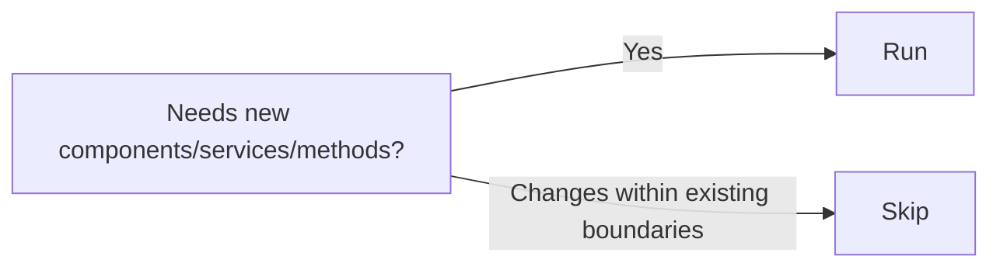

# Stage 8: Application Design

**Owner:** Solution Architect (SA) · **Conditional** (new components needed) · **Approval required**

## When to run / skip



## Purpose

Architectural design — components, methods, services, dependencies. Open ADRs for trade-offs.

## Inputs

- `requirements.md`, `stories.md`
- `product-design/` if Stage 7 ran — including the HTML mockups in `product-design/mockups/`; component boundaries should respect mockup screen structure
- `reverse-engineering/` if brownfield
- `00-knowledge/conventions/architecture-boundaries.md`

## Steps

1. **Domain modeling** — entities, value objects, aggregates.
2. **Component design** — clear boundaries per project's architecture-boundaries extension.
3. **Method/service definitions** — signatures, contracts.
4. **Dependency mapping** — internal + external.
5. **Boundary verification** — run against project's architecture rules. Any cross-boundary call needs ADR.
6. **Open ADR** for each architectural trade-off (don't bake assumptions silently).

## Outputs

To `aidlc-docs/inception/application-design/`:

| File | Content |
|---|---|
| `application-design.md` | Consolidated design narrative |
| `components.md` | Component definitions + ownership + layer |
| `component-methods.md` | Method signatures, contracts |
| `services.md` | Service definitions, APIs |
| `component-dependency.md` | Dependency matrix |

Plus ADRs to `adrs/ADR-NN-*.md` for trade-offs.

## ADR triggers

Open an ADR when:
- Sync vs async choice
- Tech stack pick (Redis vs Memcached, Postgres vs MySQL)
- Data model shape (normalized vs denormalized)
- Consistency model (strong vs eventual)
- Build vs buy
- Cross-boundary calls

## Approval gate

```
Application Design complete.
- Components: [N] new, [M] modified
- Services: [K]
- Cross-boundary calls: [L] (all documented in ADRs)
- ADRs opened: [list]

→ Request Changes
→ Continue to Stage 9 (Units Generation)
```
