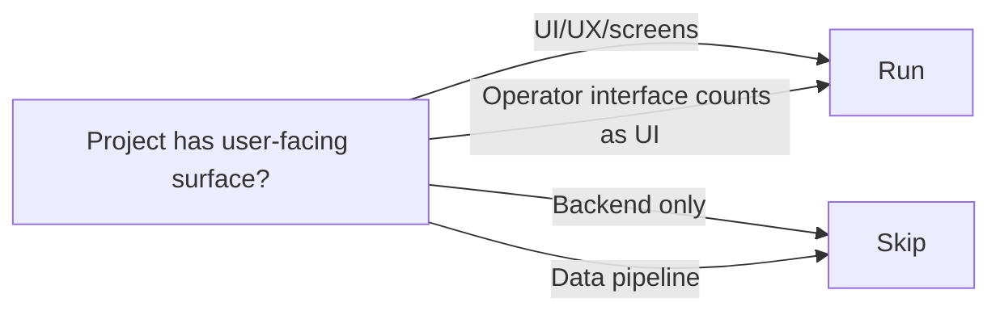

# Stage 7: Product Design

**Owner:** Product Designer · **Conditional** (UI involved) · **Approval required**

## When to run / skip



## Purpose

Produce the experience specification with **3 verifiable layers** (MVVM-style):
- **Look & feel** — `design-tokens.md` (project-resolved token catalog) — what colors, type, spacing, radius, shadow, motion the FE may use
- **Functionality** — `uiux-spec.md` (master narrative) + `mockups/*.html` (per-screen visual) — what screens exist, sitemap, menus, flows, coverage
- **Data binding** — `mockups/*.view-model.md` (per-screen MVVM contract) — which entity.attribute each field binds to, format, validation, computed-field formula, state behavior

These three contracts together make Stage 14c conformance audit mechanically verifiable.

## Inputs

- `aidlc-docs/inception/user-stories/stories.md` + `personas.md`
- `aidlc-docs/inception/application-design/data-model.md` (REQUIRED for view-model authoring — ENT-NN reference)
- `.claude/skills/kafi-design-system/SKILL.md` (KAFI brand-level design system — always load for UI work)
- `00-knowledge/design-system/` if project has overrides on top of KAFI standard

## Steps

1. Load the KAFI design system skill (`.claude/skills/kafi-design-system/SKILL.md`). Apply its tokens, typography, components, and patterns.
2. **Step A · Author `design-tokens.md` FIRST** (use `templates/design-tokens.md`):
   - Inherit from KAFI base; declare project-specific overrides with rationale
   - Catalog every token code will use: colors (semantic + raw with WCAG contrast notes), typography (font stacks + scale), spacing (4pt grid), radius, shadow elevation, motion (easing + duration), z-index, breakpoints
   - Decide component library (shadcn/ui · custom · Radix · …) with rationale
   - Locked tokens become the FE source of truth for Stage 14c audit — no ad-hoc hex/px allowed in code
3. For each user-facing story, define:
   - **User flow** — happy path + edge cases, authored in `user-flows.md` (use `templates/user-flows.md`) as **Mermaid `sequenceDiagram`** (one per cross-screen flow). Actor lanes: `User` · `<Screen>` · `<Handler>` · `<Service>` · `<Repo>` · `<DB>`. Each step labeled (`click Submit`, `POST /deals`, `createDeal()`, …); error/edge paths as `alt` blocks. Every flow in uiux-spec §5 has ≥1 sequenceDiagram here. This is the upstream contract Stage 10 `code-flow.md` + Stage 14c flow-conformance audit trace against.
   - **Journey map** — emotional/contextual states
4. Define **information architecture** — content hierarchy, navigation chrome (top nav · side nav · breadcrumbs · footer).
5. **Step B · Generate HTML mockups** under `mockups/`. Use the design-system skill to render each key screen as a **self-contained HTML file** (inline CSS using CSS custom properties referencing `design-tokens.md`, NOT hex literals). One file per key screen. Each mockup must show every state: default, empty, error, loading (and hover/disabled where relevant).
6. **Step C · For each mockup, author paired `<screen>.view-model.md`** (use `templates/view-model.md`):
   - Field bindings table: every on-screen field → source `entity.attribute` (cite ENT-NN from data-model.md) → type → format → validation → state behavior
   - Computations: formulas for derived fields
   - State bindings: default · empty · loading · error · disabled · (others)
   - Actions / events: button → domain operation mapping
   - **§6 Layout sketch (both forms):** a Mermaid `flowchart TB` of the component hierarchy (agent-facing, structural) AND an ASCII box-drawing (human-facing, spatial). Lets agents grasp layout without parsing HTML.
7. **Step D · Author `uiux-spec.md`** (master narrative, use `templates/uiux-spec.md`):
   - Sitemap (top-level page tree)
   - Navigation chrome (top nav · side nav · breadcrumbs · footer)
   - Screen catalog (table: ID, route, mockup link, view-model link, stories, target unit, states)
   - Cross-screen flows summary (link to user-flows.md detail)
   - Key UX decisions / ADRs
   - Accessibility posture (link to a11y-notes.md detail)
   - Coverage matrix · stories → screens (surfaces gaps where a US has no covering screen)
8. Define interaction patterns (micro-interactions, transitions, state changes) in `interaction-specs.md` (system-wide behavior that static HTML can't fully express).
9. Optionally produce lo-fi `wireframes/` for divergent exploration before committing to HTML.
10. Reference design system components everywhere — do not invent new components without justification.
11. Write `mockups/index.md` machine-readable manifest mapping each HTML file → view-model file → stories → target unit → states (use `templates/mockup-index.md`).

## Outputs

To `aidlc-docs/inception/product-design/`:

| File | Content |
|---|---|
| `design-tokens.md` | **Project-level token catalog** (NEW v0.7, FIRST output) · look & feel contract for Stage 14c token-discipline audit |
| `uiux-spec.md` | **Master narrative** (NEW v0.7) · single canonical entry point: sitemap + nav chrome + screen catalog + flows + coverage matrix |
| `mockups/<screen>.html` | Per screen, self-contained HTML using CSS variables from `design-tokens.md` (v0.6) |
| `mockups/<screen>.view-model.md` | **Per screen, MVVM data-binding contract** (NEW v0.7) · sibling to HTML mockup |
| `mockups/index.md` | Machine-readable manifest (screen → file → view-model → stories → unit) · template `mockup-index.md` |
| `user-flows.md` | **Mermaid `sequenceDiagram` per cross-screen flow** (actor → screen → handler → service → repo → DB · alt blocks for errors). Upstream contract for Stage 10 code-flow + Stage 14c flow-conformance audit. |
| `information-architecture.md` | Sitemap detail (may be subsumed by uiux-spec.md §2-3) |
| `interaction-specs.md` | System-wide component interactions, states, transitions |
| `accessibility-notes.md` | WCAG 2.1 AA considerations (detail; uiux-spec.md posture points here) |
| `wireframes/` | (Optional) Low-fidelity sketches for exploration |

## Approval gate

Designer + PM review.

```
Product Design complete.
- design-tokens.md: ✓ (overrides + WCAG notes)
- uiux-spec.md: ✓ (master narrative)
- HTML mockups: [list mockups/*.html files]
- View-models: [list mockups/*.view-model.md files] · coverage 1:1 with HTML mockups ✓
- Stories covered: [US-NN list] / [total UI stories] · coverage matrix gaps: [list or "None"]
- States per mockup: [default/empty/error/loading ✓]
- Design tokens used (only): [N tokens cited] · ad-hoc CSS values: 0
- Custom components needed: [list with justification]

→ Request Changes
→ Continue to Stage 8 (Application Design)
```

## Watch for

- **Ad-hoc CSS values** in mockup HTML (hex literals, raw px, font-family strings outside declared stack) — every visual value must be a token
- **Mockups missing negative states** (empty / error / loading) — required, not optional
- **Custom components** when design system would do
- **Screens referenced by a story but with no HTML mockup** (coverage gap — Stage 14c will block)
- **HTML mockup without paired view-model.md** — view-model is the data contract, not optional
- **View-model fields not bound to ENT-NN** from data-model.md
- **Format strings not declared** (e.g., "Bond face value" without specifying VND grouping + decimals)
- **Computed fields without formula** — Stage 14b cannot derive boundary tests without it
- Ungrounded UX assumptions
- Missing accessibility considerations
