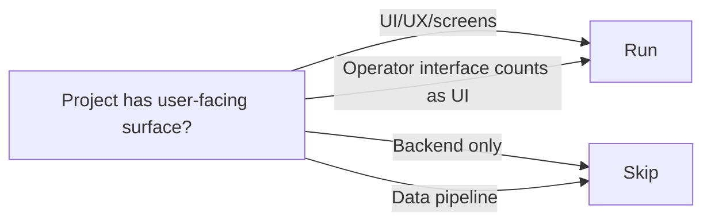

# Stage 7: Product Design

**Owner:** Product Designer · **Conditional** (UI involved) · **Approval required**

## When to run / skip



## Purpose

Produce experience specification. Informs Application Design (component boundaries) and Code Generation (interaction specs).

## Inputs

- `aidlc-docs/inception/user-stories/stories.md` + `personas.md`
- `.claude/skills/kafi/design-system/SKILL.md` (KAFI brand-level design system — always load for UI work)
- `00-knowledge/design-system/` if project has overrides on top of KAFI standard

## Steps

1. Load the KAFI design system skill (`.claude/skills/kafi/design-system/SKILL.md`). Apply tokens, typography, components, and patterns it defines.
2. For each user-facing story, define:
   - **User flow** — happy path + edge cases
   - **Journey map** — emotional/contextual states
3. Define **information architecture** — content hierarchy, navigation.
4. Create **key screen designs** at appropriate fidelity:
   - Lo-fi wireframes for divergent exploration
   - Hi-fi designs for components going to Code Generation
5. Define **interaction patterns** — micro-interactions, transitions, states.
6. Reference design system components everywhere — do not invent new components without justification.

## Outputs

To `aidlc-docs/inception/product-design/`:

| File | Content |
|---|---|
| `user-flows.md` | Flow diagrams per story |
| `information-architecture.md` | Page tree, navigation, content hierarchy |
| `wireframes/` | Low-fidelity sketches (Mermaid, ASCII, or links to images) |
| `screen-designs/` | High-fidelity designs (Markdown specs + image links) |
| `interaction-specs.md` | Component-level interactions, states, transitions |
| `accessibility-notes.md` | WCAG 2.1 AA considerations |

## Approval gate

Designer + PM review.

```
Product Design complete.
- User flows: [N]
- Screen designs: [M]
- Design system components used: [list]
- Custom components needed: [list with justification]

→ Request Changes
→ Continue to Stage 8 (Application Design)
```

## Watch for

- Custom components when design system would do
- Ungrounded UX assumptions
- Missing accessibility considerations
- Story coverage gaps
