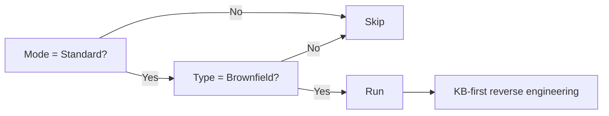

# Stage 3: Reverse Engineering

**Owner:** Solution Architect (SA) · **Conditional** · **Standard mode + Brownfield only**

## When to run / skip



## Purpose

Document existing system before extending it. KB is primary source — never scan code without KB grounding.

## Execution

1. **Plan part** — write to `aidlc-docs/inception/plans/reverse-engineering-plan.md`:
   - Which KB sections to load
   - Which code areas to inventory
   - Estimated complexity
   - Questions about scope of reverse engineering (focus areas)
2. User approves plan.
3. **Execute part** — generate 6 outputs to `aidlc-docs/inception/reverse-engineering/`:

| File | Content |
|---|---|
| `business-overview.md` | What the system does, who uses it (from KB) |
| `architecture.md` | High-level architecture matching KB layer/component map |
| `code-structure.md` | Code organization, module layout |
| `component-inventory.md` | Components, services, libraries, external dependencies |
| `dependencies.md` | Dependency matrix (internal + external) |
| `technology-stack.md` | Languages, runtimes, frameworks, databases, infra |

## KB-first rule

For each output:
- Start from KB.
- Cross-reference code only to verify or fill gaps.
- Cite KB sections: `[KB §X.Y from architecture/<file>.md]`.
- If code contradicts KB → flag as open item, don't silently update.

## Open items

For any interface contract that's unclear in KB and code:
```
Open — pending [interface owner]. See 00-knowledge/open-items.md#interface-X
```

## Completion

```
Reverse Engineering complete.
Outputs:
- business-overview.md
- architecture.md
- code-structure.md
- component-inventory.md
- dependencies.md
- technology-stack.md

Open items surfaced: [N]
Extension compliance: ✓ all

→ Request Changes
→ Continue to Stage 4 (Requirements Analysis)
```
