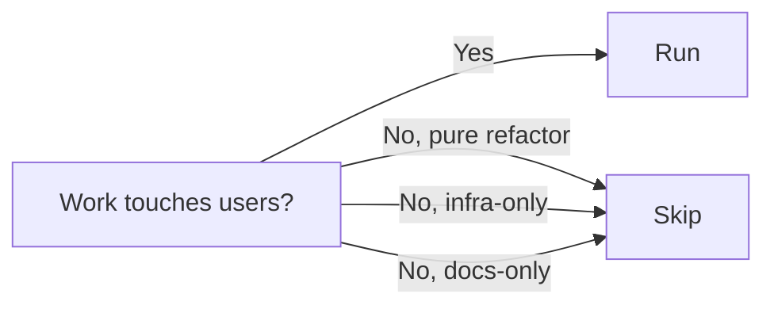

# Stage 5: User Stories

**Owner:** BA · **Conditional** (user-facing only) · **Approval required**

## When to run / skip



## 2-part execution

### Part 1: Planning

Write `aidlc-docs/inception/plans/user-stories-plan.md`:

```markdown
# User Stories Plan

## Stories to generate (from requirements)
- [ ] US-01: [name] — derived from REQ-01
- [ ] US-02: [name] — derived from REQ-02
- ...

## Questions
## Question: Persona detail
A) Detailed personas with goals + frustrations
B) Minimal personas — just role name and primary need
C) Reuse personas from existing project
D) Other (describe below)

[Answer]: 

## Question: AC format
A) Strict G/W/T (Given/When/Then)
B) BDD scenarios
C) Bullet list with measurable criteria
D) Mix as appropriate

[Answer]: 

## Question: Role naming
A) Use project's confirmed role taxonomy (from 00-knowledge/roles.md)
B) Use neutral placeholders (user, operator)
C) Other (specify)

[Answer]: 
```

User approves plan + answers.

### Part 2: Generation

Generate `aidlc-docs/inception/user-stories/stories.md` + `personas.md`.

### Story format

```markdown
## US-01: [Title]

**Persona:** [link to personas.md#persona-name]
**Source:** REQ-01, REQ-02

**Story:** As a [persona], I want [capability] so that [outcome].

**Acceptance Criteria:**
- Given [context]
  When [action]
  Then [observable result]
- Given [context]
  When [action]
  Then [observable result]

**Open items:** [list or none]
**KB citations:** [list]
**Estimated unit:** UNIT-X (filled in Stage 9)
```

## Watch for

- Acceptance criteria that aren't testable
- Vague outcomes ("user is happy")
- Missing negative paths
- Role-name commitments before BTS confirms taxonomy

## Completion

```
User Stories complete.
Outputs:
- stories.md ([N] stories)
- personas.md ([M] personas)

Open items surfaced: [list]
Coverage: All requirements have at least one story.

→ Request Changes
→ Continue to Stage 6 (Workflow Planning)
```
