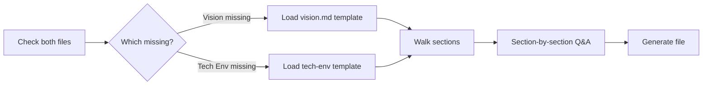

# Sub-flow B: fill-gaps

**Activates when** one of `vision.md` or `technical-environment.md` exists but not both.

## Identify the gap

## For missing Vision Document

1. Load `templates/00-pre-inception/vision.md`.
2. Read the existing `technical-environment.md` for stack hints.
3. Walk sections in order. For each section:
   - If user input is needed → write questions to `aidlc-docs/inception/discovery/vision-draft-questions.md` with `[Answer]:` tags.
   - If derivable from KB or existing files → draft directly with citation.
4. After each major section, present mini-completion for review.
5. When done, write `aidlc-docs/inception/discovery/vision.md`.

**Priority sections (ask first):**
- Problem statement
- Target users
- Success metrics (push for measurable)
- Scope IN / OUT

## For missing Technical Environment Document

1. Load `templates/00-pre-inception/technical-environment.md`.
2. Read existing `vision.md` for application context.
3. Walk sections, focusing on:
   - **Stack** (language, runtime, framework) — ask if unclear
   - **Cloud target** — ask (this is KAFI's open item W2)
   - **Prohibited libraries** — ask team/architect
   - **Example code patterns** — derive from KB or ask
   - **Integration constraints** — derive from `00-knowledge/systems-catalog.md`
4. Write `aidlc-docs/inception/discovery/technical-environment.md`.

## Approval gate

Each completed file gets reviewed before proceeding to Inception.

## Outputs

- `aidlc-docs/inception/discovery/vision.md` (if was missing)
- `aidlc-docs/inception/discovery/technical-environment.md` (if was missing)
- `aidlc-docs/inception/discovery/[doc]-draft-questions.md` — clarification log
