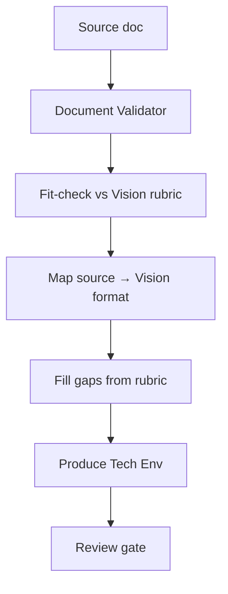

# Sub-flow C: map-existing

**Activates when** user has a legacy BRD/PRD/requirements document.

## Execution



## Step 1: Document Validator

If not already run, run `document-validator.md` on the source first.

## Step 2: Fit-check against Vision rubric

For each Vision rubric item:
- **Present**: copy/adapt from source
- **Partial**: needs enrichment — flag for user input
- **Missing**: gap — needs to be authored

Document the fit-check in `aidlc-docs/inception/discovery/fit-check.md`.

## Step 3: Map source to Vision Document

1. Load `templates/vision.md`.
2. For each Vision section:
   - If rubric says Present → map content from source
   - If rubric says Partial → seed with source + question for enrichment
   - If rubric says Missing → write question
3. Preserve original at `aidlc-docs/inception/discovery/source-appendix.md`. Note: original file remains in git history too.
4. Write `aidlc-docs/inception/discovery/vision.md`.

## Step 4: Fill gaps

Write all gap questions to `aidlc-docs/inception/discovery/vision-gap-questions.md`:

```markdown
## Question: [Section name]
Your [legacy doc] doesn't address [topic].
A) [Concrete option from KB/conventions]
B) [Alternative]
C) [Alternative]
D) Defer to open items
E) Other (describe below)

[Answer]: 
```

Loop until all gaps are filled or deferred to open items.

## Step 5: Produce Technical Environment Document

Following `subflow-fill-gaps.md` for Tech Env.

## Step 6: Approval gate

Present completion:

```
Mapping complete.
- vision.md: drafted from <source>, with N gaps filled
- source-appendix.md: original preserved
- technical-environment.md: drafted

→ Request changes
→ Continue to Inception
```

## Outputs

- `aidlc-docs/inception/discovery/vision.md`
- `aidlc-docs/inception/discovery/source-appendix.md`
- `aidlc-docs/inception/discovery/fit-check.md`
- `aidlc-docs/inception/discovery/vision-gap-questions.md`
- `aidlc-docs/inception/discovery/technical-environment.md`
