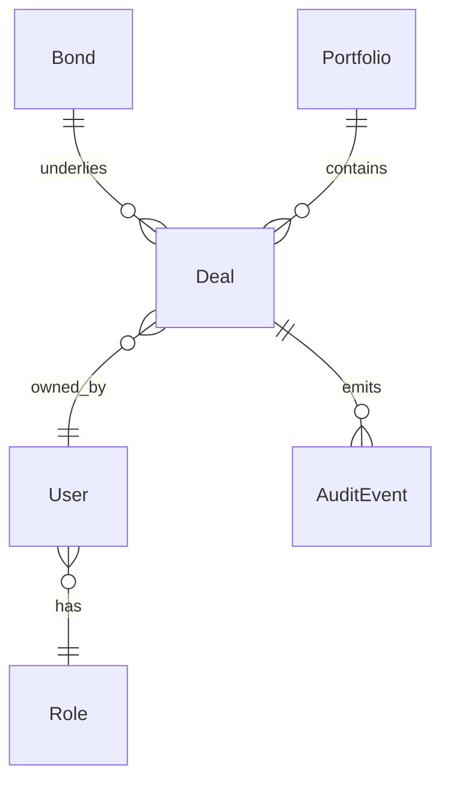

# Data Model — [Project]

> Stage 8 deliverable · SA-owned
> System-wide entities, attributes, relationships, invariants, schemas
> Stage 10 `domain-entities.md` derives per-unit views from here
> Stage 7 `view-model.md` cites ENT-NN attributes for field bindings

**Status:** Draft | Locked
**Owner:** [SA name]
**Last updated:** [Date]
**Version:** [v0.X]

---

## 1. Entity catalog

Every entity has a `ENT-NN` ID. Names + types are stable once locked — downstream artifacts cite them.

### ENT-01: [Entity name]

**Type:** Aggregate root | Entity | Value object | Read model
**Source:** Vision §X · REQ-NN · BRD §Y
**Lifecycle:** [Created · Updated · Deleted by which actor / when]
**Persistence:** [Table / collection / event-sourced / in-memory]

**Attributes:**

| Attribute | Type | Required | Default | Constraints / Format | Cited by view-model |
|---|---|---|---|---|---|
| `id` | UUID | yes | — | RFC 4122 v4 | — |
| `face_value` | double | yes | — | min 1_000_000 · max 10_000_000_000 · VND | view-model: Deal capture, Deal detail |
| `yield` | float | yes | — | 0 ≤ x ≤ 100 · 4 decimal places · % | view-model: Deal capture |
| `settlement_date` | date | yes | — | ISO 8601 · future date only | view-model: Deal capture |
| `coupon_dates` | date[] | computed | — | derived from settlement_date + tenor + coupon_frequency | view-model: Deal detail (read-only) |
| `status` | enum | yes | "draft" | one of [draft · pending · approved · settled · cancelled] | view-model: Deal list, Deal detail |

**Invariants:**
- `settlement_date > created_at`
- `yield × face_value` produces a non-negative number
- `status` transitions: `draft → pending → approved → settled` (forward only) · `cancelled` reachable from any non-settled state

**Behaviors / domain operations:**
- `submit()` — `draft → pending`
- `approve(by: User)` — `pending → approved` (requires Approver role)
- `settle()` — `approved → settled` (requires settlement_date ≤ today)
- `cancel(reason: string)` — any non-settled status → `cancelled`

### ENT-02: [Next entity]

[Same shape as above]

---

## 2. Relationships

How entities reference each other. Cardinality + ownership.



| From | To | Cardinality | Type | Owner | Notes |
|---|---|---|---|---|---|
| Bond (ENT-03) | Deal (ENT-01) | 1 → many | composition | Bond | Deals reference one Bond; deletion of Bond requires no active Deals |
| Deal (ENT-01) | User (ENT-04) | many → 1 | association | User | Audit-trailed |
| Deal (ENT-01) | AuditEvent (ENT-05) | 1 → many | composition | Deal | Append-only |

## 3. Value objects (non-entity types)

Reusable shapes that aren't entities themselves but are referenced as attribute types.

| Name | Shape | Used by |
|---|---|---|
| `Money` | `{ amount: double, currency: string }` | Deal.face_value · Portfolio.total_value |
| `DateRange` | `{ start: date, end: date }` | Deal.tenor_range |
| `PII` | (marker — wraps any value to indicate privacy classification) | User.tax_id · User.national_id |

## 4. Enums

| Enum | Values | Cited by |
|---|---|---|
| `DealStatus` | draft · pending · approved · settled · cancelled | Deal.status |
| `UserRole` | viewer · trader · approver · admin | User.role |
| `Currency` | VND · USD · EUR · JPY | Money.currency |

## 5. Schemas (concrete persistence representation)

If using a relational DB, SQL schemas. If document-store, JSON-schema. If both, both.

```sql
CREATE TABLE deals (
    id UUID PRIMARY KEY,
    bond_id UUID NOT NULL REFERENCES bonds(id),
    user_id UUID NOT NULL REFERENCES users(id),
    face_value NUMERIC(18, 0) NOT NULL CHECK (face_value >= 1000000 AND face_value <= 10000000000),
    yield NUMERIC(8, 4) NOT NULL CHECK (yield >= 0 AND yield <= 100),
    settlement_date DATE NOT NULL,
    status TEXT NOT NULL CHECK (status IN ('draft', 'pending', 'approved', 'settled', 'cancelled')),
    created_at TIMESTAMPTZ NOT NULL DEFAULT now(),
    updated_at TIMESTAMPTZ NOT NULL DEFAULT now()
);
```

## 6. Data classifications (privacy + audit)

| Entity / Attribute | Classification | Implications |
|---|---|---|
| User.national_id | PII (sensitive) | Encryption at rest · access logged · masked in UI · privacy extension applies |
| User.email | PII (basic) | Access logged · privacy extension applies |
| Deal.* | Audit-trailed | Every change emits AuditEvent · audit-trail extension applies |

## 7. Open items

- Open — pending [owner]: [decision needed] · See `00-knowledge/open-items.md#[id]`

---

## Audit hook (Stage 14c · Code audit)

Generated code's domain entities MUST match this data-model.md: same names, same types, same constraints, same invariants. Stage 10 `domain-entities.md` per unit cites ENT-NN it implements; Stage 14a code references those entities; Stage 14c audit checks consistency.

KB cited: REQ-NN · Vision § · `00-knowledge/conventions/architecture-boundaries.md`
Related: `application-design.md` · `components.md` · per-unit `domain-entities.md` · view-models · ADRs
