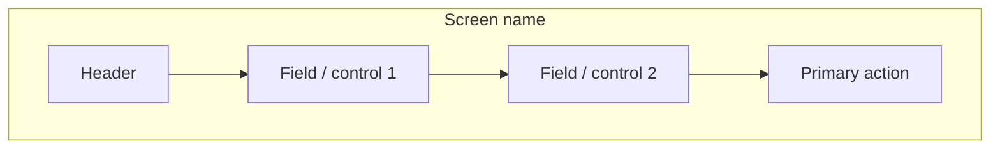

# Design-Lite — [Screen / Feature]

> Stage 7 artifact (Minimal depth) · Designer-owned
> Lightweight alternative to the full uiux-spec + per-screen view-model set, for trivial UI
> Use ONLY when: single small screen, no complex data binding, internal tool, low risk

**Status:** Draft | Approved
**Owner:** [Designer name]
**Last updated:** [Date]
**Stories:** US-NN · **Target unit:** UNIT-NN

---

## When design-lite is allowed

Use this instead of the full Stage 7 set (`design-tokens.md` + `uiux-spec.md` + per-screen
`mockups/*.html` + `view-model.md`) ONLY when ALL hold:
- Single screen or a couple of trivial screens
- CRUD-ish, no computed fields / complex validation
- Internal tool, not customer-facing
- Low regulatory / money / PII exposure

If any fail → use the full Stage 7 deliverables. When in doubt, go full.

## 1. Screen purpose

[1-2 sentences.]

## 2. Layout sketch

(ASCII box-drawing acceptable too.)

## 3. Fields (lite binding)

| Field | Type | Source (entity.attribute) | Format | Validation |
|---|---|---|---|---|
| [name] | [type] | [ENT-NN] | [format] | [rule] |

## 4. States

- default · empty · error (loading only if async)

## 5. Tokens

Uses KAFI design system defaults (no project `design-tokens.md` override needed at lite tier).
If any custom value is needed → escalate to full design-tokens.md.

## 6. Accessibility

- Labels on all fields · keyboard navigable · WCAG 2.1 AA

---

## Audit note (Stage 14c)

Even at lite tier, Stage 14c still checks: fields bind to declared entities, validation
enforced, states rendered, tokens (no ad-hoc hex). The bar is the same; only the spec volume
is smaller.

KB cited: `data-model.md` (ENT-NN) · KAFI design system skill
Related: full-tier `uiux-spec.md` · `view-model.md` (escalate here if complexity grows)
