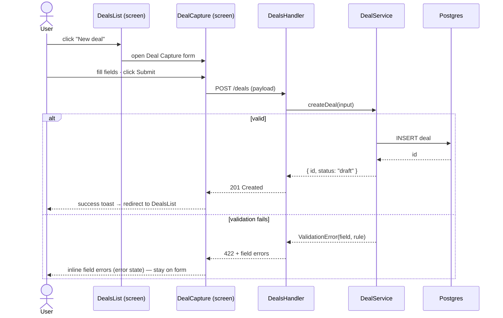

# User Flows — cross-screen journeys

> Stage 7 deliverable · Designer-owned · One Mermaid `sequenceDiagram` per cross-screen flow
> The upstream contract that Stage 10 `code-flow.md` and Stage 14c sub-check #5 (flow conformance) trace against
> Every cross-screen flow named in `uiux-spec.md` §5 must have ≥1 sequenceDiagram here

**Status:** Draft | Approved
**Owner:** [Designer name]
**Last updated:** [Date]
**Derives from:** `uiux-spec.md` (§5 cross-screen flows) · `user-stories/stories.md` (US-NN) · `mockups/*.html`

---

## How to use

For every cross-screen journey (a user goal that spans more than one screen), declare the
step sequence as a Mermaid `sequenceDiagram`. Use the standard **actor lanes** so the flow
reads consistently and stays machine-parseable for the downstream flow-conformance audit:

`User` · `<Screen>` · `<Handler>` (route/controller) · `<Service>` (business logic) · `<Repo>` (data access) · `<DB>` / `<External>`

Label every step with the real interaction or call (`click Submit`, `POST /deals`, `createDeal()`, …).
Show error / edge journeys as `alt` blocks. One happy path + at least one error path per flow.
This is a **UX-level** contract (how screens connect) — Stage 10 `code-flow.md` refines it to actual
code call paths per unit; do not put code internals here.

---

## Flow: [e.g. Capture a new deal]

**Goal:** [what the user is trying to accomplish] · **Stories:** US-NN, US-NN · **Entry:** [screen/route] · **Exit:** [success screen/state]

## Flow: [next cross-screen journey]

[Same shape — one `sequenceDiagram` per flow · happy path + `alt` for error/edge.]

---

## Coverage (flows ↔ stories ↔ screens)

Every cross-screen flow in `uiux-spec.md` §5 appears here, and every flow traces to ≥1 story.

| Flow | Stories (US-NN) | Screens touched | Mockups | Error paths shown |
|---|---|---|---|---|
| Capture a new deal | US-01, US-04 | DealsList → DealCapture | `deals-list.html` · `deal-capture.html` | validation fail |
| [flow] | [US-NN] | [screen → screen] | [files] | [edge case] |

---

## Audit hook (downstream conformance)

- **Stage 10 (`code-flow.md`):** each flow here is refined into per-unit code call sequences (View → Handler → Service → Repo → DB), keeping the same actor lanes so the two diagrams align.
- **Stage 14c · sub-check #5 (Flow conformance):** the generated code's call graph is diffed against these sequences (via `code-flow.md`). A flow with no matching code path → ✗; an error branch here with no catch path in code → ✗; wrong order → ✗ (with diff).

KB cited: `uiux-spec.md` §5 · `user-stories/stories.md` · `mockups/index.md`
Related: `mockups/<screen>.view-model.md` (per-screen data binding) · `code-flow.md` (Stage 10 code-level refinement)
