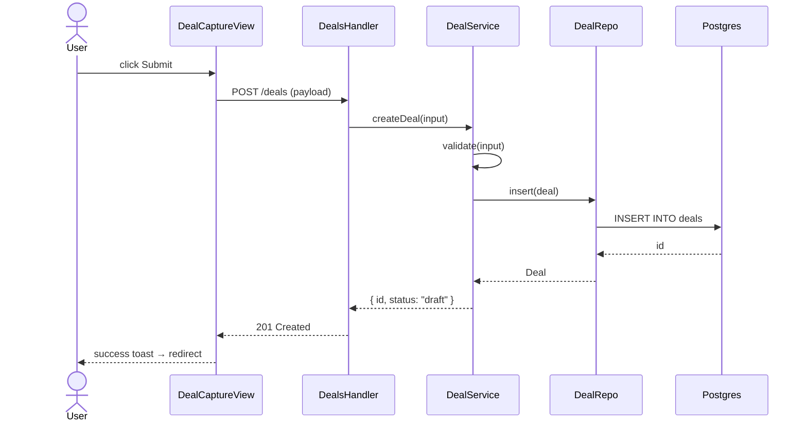
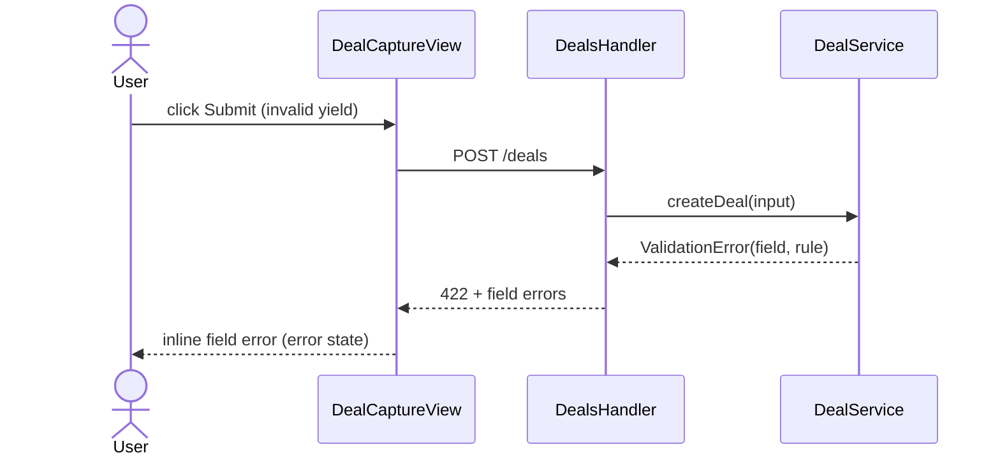

# Code Flow — UNIT-NN [Unit name]

> Stage 10 deliverable · SA-owned · One per unit (if unit has user-facing or multi-component logic)
> Mermaid sequenceDiagram of the function-call path for each user action in this unit
> Stage 14c sub-check #5 audits that generated code's actual call paths match these sequences

**Status:** Draft | Approved
**Owner:** [SA name]
**Last updated:** [Date]
**Unit:** UNIT-NN · [name]
**Derives from:** `user-flows.md` (Stage 7) + `functional-design/` (this unit) + `components.md` (Stage 8)

---

## How to use

For every user action this unit implements, declare the code-level call sequence: which
function/method calls which, in order, across the architecture layers (View → Handler →
Service → Repo → DB / external). Use Mermaid `sequenceDiagram` so it renders AND is
machine-parseable for the Stage 14c flow-conformance audit.

Participants should match real code identifiers (or alias-map them). The audit greps the
generated code's call graph and diffs it against these sequences.

---

## User Action: [e.g. Submit a deal]

**Triggered from:** [screen / endpoint] · **Stories:** US-NN · **REQ:** REQ-NN

## Error path: [e.g. Validation fails]

## User Action: [next action]

[Same shape — one sequence per happy path + one per error/edge path.]

---

## Cross-boundary calls (declared)

Every call that crosses an architecture boundary (per `architecture-boundaries.md`) must be
listed here AND backed by an ADR. Stage 14c flags undeclared cross-boundary calls as ✗.

| From | To | Why | ADR |
|---|---|---|---|
| DealService | External pricing API | live yield curve | ADR-04 |
| DealRepo | outbox table | audit-trail extension | — (extension-wired) |

---

## Audit hook (Stage 14c · sub-check #5 Flow conformance)

Stage 14c verifies:
- Every declared sequence has a matching call chain in `src/` for this unit
- Function names in code match (or alias-map to) the participants/calls here
- Error/edge paths have corresponding catch/error branches in code
- No cross-boundary call in code that isn't declared above

Missing call → ✗. Extra undeclared cross-boundary call → ✗. Wrong order → ✗ (with diff).

KB cited: `user-flows.md` · `functional-design/business-logic-model.md` · `components.md` · ADRs
Related: `view-model.md` (UI actions §5) · per-unit `conformance-report.md`
