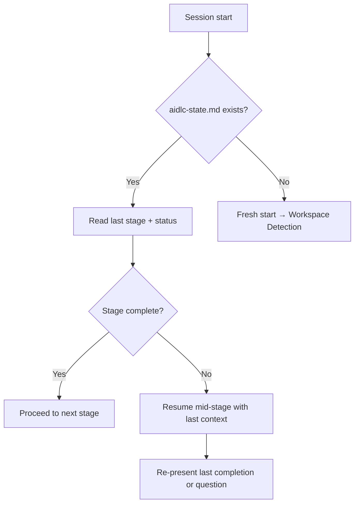

# Session Continuity

Sessions get interrupted. The workflow recovers from `aidlc-state.md`.

## Resume protocol



## State file format

`aidlc-docs/aidlc-state.md`:

```markdown
# AI-DLC State

## Project
- Mode: [Lite | Standard]
- Type: [Greenfield | Brownfield]
- Phase: [if defined]
- Started: [ISO 8601]
- Last activity: [ISO 8601]

## Current Stage
- Phase: [Phase name]
- Stage: [Stage N — Name]
- Status: [planning | execution | awaiting-approval | complete]
- Last user input: [reference to audit.md entry]

## Stages Completed
- [✓] 1. Workspace Detection
- [✓] 2. KB Context Loading
- [✓] 3. Reverse Engineering
- [ ] 4. Requirements Analysis  ← current
- [ ] 5. User Stories
...

## Extension Configuration
- audit-trail: enforced
- personal-data-privacy: [enabled / disabled]
- [project extensions]: [status]

## Open Decisions (from project register)
- [ID]: [status]
```

## What to do on resume

1. Read `aidlc-state.md`.
2. Display: "Resuming [Stage N — Name] (Status: [status])"
3. If `awaiting-approval`: re-present the last completion message.
4. If `execution`: load relevant rule-detail file and continue.
5. If `planning`: re-display plan and last questions.
6. Append `audit.md` with resume entry.

## What NOT to do on resume

- Don't re-display welcome message
- Don't re-detect workspace (state already says mode + type)
- Don't redo completed stages
- Don't re-ask answered questions
