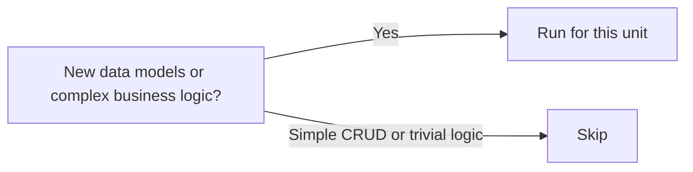

# Stage 10: Functional Design

**Owner:** Solution Architect (SA, sole) · **Conditional** (per-unit) · **Approval required**

## When to run / skip



## Purpose

Detail business logic, rules, and domain entities for one unit. Bridges Application Design → Code Generation.

## Inputs

- `aidlc-docs/inception/application-design/`
- `aidlc-docs/inception/user-stories/stories.md` (filtered to this unit's stories)
- `aidlc-docs/inception/product-design/interaction-specs.md` if UI

## Outputs

To `aidlc-docs/construction/{unit}/functional-design/`:

| File | Content |
|---|---|
| `business-logic-model.md` | Algorithms, flows, calculations |
| `business-rules.md` | Validation rules, decision tables |
| `domain-entities.md` | Entity definitions, relationships, invariants |
| `frontend-components.md` | UI component hierarchy + props + state (if UI) |

## Steps

1. For each story in this unit:
   - Extract business logic into `business-logic-model.md`.
   - Capture rules in `business-rules.md` as decision tables.
   - Refine domain entities from Application Design.
2. If UI: detail frontend component hierarchy with props, local state, events.
3. Run extension compliance summary.
4. Log open items.

## Approval gate

```
Functional Design for UNIT-{N} complete.
- Business rules captured: [K]
- Domain entities: [J]
- Open items: [list]

→ Request Changes
→ Continue to Stage 11 (NFR Requirements)
```
