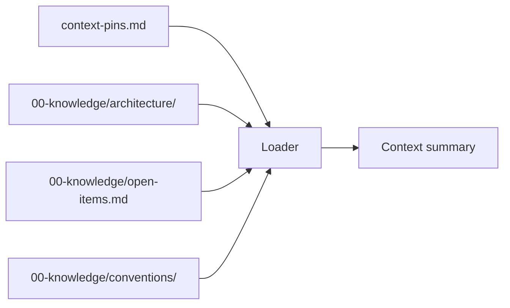

# Stage 2: KB Context Loading

**Owner:** AI agent · **Always runs** · **No approval gate**

## Purpose

Load project KB sections and conventions into agent memory for the upcoming stages.

## Execution



## Steps

1. Read `ai-dlc/context-pins.md` if exists. Otherwise use defaults from `project.md`.
2. Load pinned KB sections from `00-knowledge/architecture/`.
3. Load `00-knowledge/open-items.md` — active open items.
4. Load `00-knowledge/conventions/naming.md` if exists.
5. Load `00-knowledge/conventions/architecture-boundaries.md` if exists.
6. Load `00-knowledge/phases.md` if exists.
7. Verify `last_verified` timestamp on each loaded file:
   - Within 90 days → OK
   - Older → warn user but load anyway
8. Present summary:
   ```
   📚 Context Loaded
   - KB sections: [N] (architecture/, [list])
   - Open items: [M] active
   - Conventions: [naming ✓, architecture-boundaries ✓, phases ✓]
   - Last verified: [oldest date]
   ```
9. Log to `audit.md`.

## Context-pin budget

Maximum 4k tokens of KB context per unit. If pin list exceeds → unit is too large; split before proceeding.

## No approval gate

Informational. Just primes context for subsequent stages.
