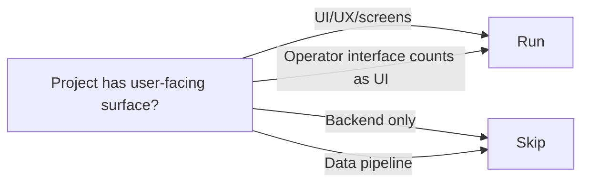

# Stage 7: Product Design

**Owner:** Product Designer · **Conditional** (UI involved) · **Approval required**

## When to run / skip



## Purpose

Produce the experience specification. Informs Application Design (component boundaries), Functional Design, and **Code Generation — the HTML mockups produced here are the FE source of truth** that Stage 14 must reproduce.

## Inputs

- `aidlc-docs/inception/user-stories/stories.md` + `personas.md`
- `.kiro/steering/kafi-design-system.md` (KAFI brand-level design system — always load for UI work)
- `00-knowledge/design-system/` if project has overrides on top of KAFI standard

## Steps

1. Load the KAFI design system steering file (`.kiro/steering/kafi-design-system.md`). Apply its tokens, typography, components, and patterns.
2. For each user-facing story, define:
   - **User flow** — happy path + edge cases
   - **Journey map** — emotional/contextual states
3. Define **information architecture** — content hierarchy, navigation.
4. **Generate HTML mockups (canonical hi-fi deliverable).** Use the design system to render each key screen as a **self-contained HTML file** (inline CSS, KAFI tokens — opens standalone in a browser) under `mockups/`. One file per key screen. Each mockup must show every state: default, empty, error, loading (and hover/disabled where relevant).
5. Optionally produce lo-fi `wireframes/` for divergent exploration before committing to HTML.
6. Define **interaction patterns** — micro-interactions, transitions, state changes — in `interaction-specs.md` (behavior that static HTML can't fully express).
7. Reference design system components everywhere — do not invent new components without justification.
8. Write the `mockups/index.md` manifest mapping each HTML file to the stories it serves and the unit that will implement it.

## Outputs

To `aidlc-docs/inception/product-design/`:

| File | Content |
|---|---|
| `mockups/` | **Self-contained HTML files, one per key screen** (design-system styled, all states). Canonical hi-fi deliverable + FE source of truth for Stage 14. |
| `mockups/index.md` | Manifest mapping screen → file → stories → target unit → states covered. |
| `user-flows.md` | Flow diagrams per story |
| `information-architecture.md` | Page tree, navigation, content hierarchy |
| `interaction-specs.md` | Component-level interactions, states, transitions |
| `accessibility-notes.md` | WCAG 2.1 AA considerations |
| `wireframes/` | (Optional) Low-fidelity sketches for exploration |
| `screen-designs/` | (Optional) Annotated specs supplementing the HTML mockups |

### `mockups/index.md` manifest format

```markdown
# Mockup manifest

| Screen | Mockup file | Stories (US-NN) | Target unit | States covered |
|---|---|---|---|---|
| Deal capture | mockups/deal-capture.html | US-03, US-04 | UNIT-02 | default · empty · error · loading |
| Portfolio view | mockups/portfolio.html | US-07 | UNIT-03 | default · loading |
```

## Approval gate

Designer + PM review.

```
Product Design complete.
- HTML mockups: [list mockups/*.html files]
- Stories covered: [US-NN list] / [total UI stories]
- States per mockup: [default/empty/error/loading ✓]
- Design system components used: [list]
- Custom components needed: [list with justification]

→ Request Changes
→ Continue to Stage 8 (Application Design)
```

## Watch for

- Mockups missing negative states (empty / error / loading) — required, not optional
- Custom components when design system would do
- Screens referenced by a story but with no HTML mockup (coverage gap — Stage 14 will block on these)
- Ungrounded UX assumptions
- Missing accessibility considerations
