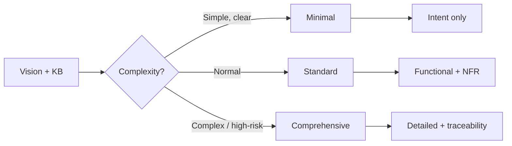

# Stage 4: Requirements Analysis

**Owner:** PM + BA · **Always runs** · **Approval required**

## Purpose

Convert Vision Document + KB into actionable functional and non-functional requirements.

## Depth (adaptive)



## Steps

1. Load:
   - `aidlc-docs/inception/discovery/vision.md`
   - `aidlc-docs/inception/discovery/technical-environment.md`
   - Pinned KB sections (from Stage 2)
   - `00-knowledge/open-items.md`
   - If brownfield: `aidlc-docs/inception/reverse-engineering/`
2. Run intent analysis: what is the user actually asking for?
3. Determine depth.
4. Generate questions to `aidlc-docs/inception/plans/requirements-questions.md` for any:
   - Ambiguous scope
   - Vague NFR thresholds
   - Open-item touch points
5. **Open items protocol:** for each requirement touching open item, emit:
   ```
   Open — pending [owner]. See 00-knowledge/open-items.md#[id]
   ```
   Never fabricate.
6. After user answers, generate:
   - `aidlc-docs/inception/requirements/requirements.md` — with REQ-NN IDs and KB citations
   - `aidlc-docs/inception/requirements/requirement-verification-questions.md` — anything still ambiguous

## Requirements format

```markdown
## REQ-01: [Short name]

**Type:** Functional | NFR
**Source:** Vision §X, KB §Y
**Priority:** Must / Should / Could

**Description:** [Plain language]

**Acceptance:** [How we know it's met — measurable]

**Open items:** [list or none]
**KB citations:** [list]
```

## Watch for

- Vague NFRs: "fast", "scalable", "robust" without numbers — push back, defer to NFR Requirements stage if user can't specify now
- Scope creep beyond Vision
- Missing measurability

## Completion

```
Requirements Analysis complete.
Outputs:
- requirements.md ([N] requirements, [M] open items)
- requirement-verification-questions.md ([K] questions)

→ Request Changes
→ Continue to Stage 5 (User Stories)
```
