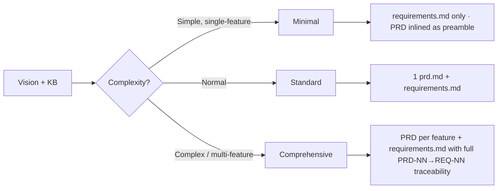

# Stage 4: Requirements Analysis

**Owner:** PM (sole) · **Always runs** · **Approval required**

## Purpose

Convert Vision Document + KB into:
1. **Product Requirements (PRD)** — feature-level product narrative (PRD-NN). What we're building, for whom, with what success criteria.
2. **Functional and non-functional Requirements** — testable technical decomposition (REQ-NN). Each REQ traces back to a PRD-NN.

PRD answers *WHAT* and *FOR WHOM*. Requirements answers *HOW THE SYSTEM MUST BEHAVE*. Both are PM-owned at this stage; together they form the bridge between Vision (north-star) and Stage 5 user stories.

## Depth (adaptive)



**When to skip PRD (Minimal depth):** Scope is a single small feature, all stakeholders already aligned via Vision, and you can express the product narrative in the requirements.md preamble (2-3 paragraphs). Otherwise, always produce a PRD.

## Steps

1. Load:
   - `aidlc-docs/inception/discovery/vision.md`
   - `aidlc-docs/inception/discovery/technical-environment.md`
   - Pinned KB sections (from Stage 2)
   - `00-knowledge/open-items.md`
   - If brownfield: `aidlc-docs/inception/reverse-engineering/`
   - If Pre-Inception sub-flow D produced a draft PRD at `aidlc-docs/ba-authoring/<feature>/prd-draft.md`, load it as starting point.
2. Run intent analysis: what is the user actually asking for? Identify distinct features (each will become one PRD file).
3. Determine depth (Minimal / Standard / Comprehensive).
4. Generate questions to `aidlc-docs/inception/plans/requirements-questions.md` for any:
   - Ambiguous scope
   - Vague NFR thresholds
   - Open-item touch points
   - Missing personas, success metrics, or scenarios needed for PRD
5. **Open items protocol:** for each PRD-NN or REQ-NN touching open item, emit:
   ```
   Open — pending [owner]. See 00-knowledge/open-items.md#[id]
   ```
   Never fabricate.
6. After user answers, generate outputs in two sub-steps:

   **Step 6a · PRD generation** (skip only at Minimal depth)
   For each major feature, produce `aidlc-docs/inception/requirements/prd-<feature>.md` using `.kiro/templates/prd.md`:
   - Feature overview, problem statement, personas, scenarios
   - PRD-NN entries (Must/Should/Could priority) with success criteria
   - Scope IN/OUT, dependencies, risks, constraints
   - Traceability footer reserves REQ-NN slots (filled in step 6b)

   **Step 6b · Requirements generation**
   Produce `aidlc-docs/inception/requirements/requirements.md` with REQ-NN entries derived from PRDs:
   - Each REQ cites its parent PRD-NN (`**Parent PRD:** prd-<feature>.md#PRD-NN`)
   - Functional + NFR mixed (NFRs may be refined later at Stage 11)
   - KB citations on every entry

   Also produce `aidlc-docs/inception/requirements/requirement-verification-questions.md` for anything still ambiguous.

7. Update PRD traceability footers — backfill REQ-NN list per PRD-NN.
8. Append `aidlc-docs/inception/requirements/audit.md` (per common cycle).
9. Update `aidlc-docs/aidlc-state.md` per common state-file maintenance rules.

## PRD format

See `.kiro/templates/prd.md`. Key structural rule:

```markdown
## 5. Features

- **[PRD-01]** [Capability name]
  - **What it does:** [user-facing behavior, plain language]
  - **Priority:** Must / Should / Could
  - **Success criteria:** [observable outcome]
  - **Decomposes to:** REQ-NN, REQ-NN+1   ← filled in step 6b
```

## Requirements format

```markdown
## REQ-01: [Short name]

**Type:** Functional | NFR
**Parent PRD:** prd-<feature>.md#PRD-NN
**Source:** Vision §X, KB §Y
**Priority:** Must / Should / Could

**Description:** [Plain language]

**Acceptance:** [How we know it's met — measurable]

**Open items:** [list or none]
**KB citations:** [list]
```

## Watch for

- **PRD without measurable success criteria** — push back. "Improve UX" is not a PRD; "Reduce deal capture time from 12 → 3 min" is.
- **Requirements without parent PRD** — if you can't trace REQ-NN to a PRD-NN, either the PRD is incomplete or the REQ is scope creep. Resolve before approval.
- **Vague NFRs:** "fast", "scalable", "robust" without numbers — push back, defer to NFR Requirements stage if user can't specify now
- **Scope creep beyond Vision**
- **Missing measurability**

## Completion

```
Requirements Analysis complete.
Outputs:
- prd-<feature>.md ([N] PRDs across [F] features) · [or skipped at Minimal depth]
- requirements.md ([M] requirements, [K] open items)
- requirement-verification-questions.md ([Q] questions)
- Traceability: [X]% of REQs linked to parent PRD-NN

→ Request Changes
→ Continue to Stage 5 (User Stories)
```
