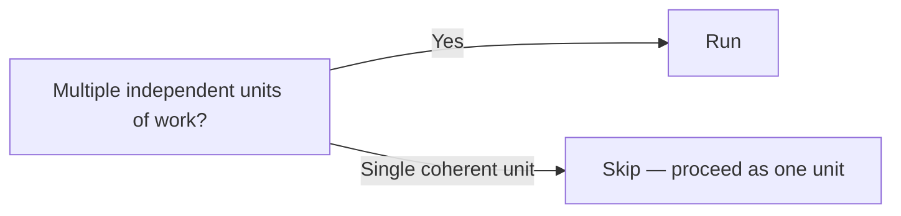

# Stage 9: Units Generation

**Owner:** Solution Architect (SA) · **Conditional** (multi-unit) · **Approval required**

## When to run / skip



## What is a Unit?

(KAFI terminology matches AWS AI-DLC "Unit of Work")

A Unit:
- Has a clear `intent` (what + why)
- Maps to one or more user stories
- Can be built independently (parallel-able with other units)
- Has its own folder under `aidlc-docs/construction/{unit-name}/`
- Has its own `pinned-context.md`

## 2-part execution

### Part 1: Planning

Write `aidlc-docs/inception/plans/units-plan.md`:

```markdown
# Units Plan

## Decomposition strategy
[Why these unit boundaries?]

## Proposed units
- [ ] UNIT-01: [name]
  - Stories: US-01, US-02
  - Depends on: (none)
- [ ] UNIT-02: [name]
  - Stories: US-03, US-04, US-05
  - Depends on: UNIT-01 (uses its API)
- [ ] UNIT-03: [name]
  - Stories: US-06
  - Depends on: UNIT-02

## Questions
## Question: Grouping strategy
A) By bounded context (DDD)
B) By user-facing feature
C) By technical layer (frontend / backend / data)
D) By team ownership
E) Other (describe below)

[Answer]: 

## Question: Parallel build order
A) UNIT-01, then UNIT-02, then UNIT-03 (strict serial)
B) UNIT-01, then UNIT-02 + UNIT-03 in parallel (after UNIT-01 done)
C) All three in parallel with mock dependencies
D) Other (specify)

[Answer]: 
```

### Part 2: Generation

Write:
- `aidlc-docs/inception/application-design/unit-of-work.md` — UNIT-NN definitions
- `aidlc-docs/inception/application-design/unit-of-work-dependency.md` — dependency matrix
- `aidlc-docs/inception/application-design/unit-of-work-story-map.md` — story-to-unit mapping

Also create per-unit folders:
- `aidlc-docs/construction/UNIT-01-name/intent.md`
- `aidlc-docs/construction/UNIT-01-name/pinned-context.md`
- (subfolders created during Construction)

## Unit definition format

```markdown
## UNIT-01: [Name]

**Intent:** [1-2 sentence what + why]

**Stories covered:**
- US-01: [title]
- US-02: [title]

**Depends on:** [list of other units, or "none"]

**Pinned context (for agent):**
- KB sections: [list]
- Open items: [list]

**Exit criteria:**
- All stories' AC met
- All NFRs met (from per-unit NFR Req)
- Code reviewed
- Build successful
```

## Approval gate

```
Units Generation complete.
- Units: [N]
- Story coverage: [all stories assigned]
- Dependency cycles: [none / list]

→ Request Changes
→ Continue to Construction (start with UNIT-01)
```
