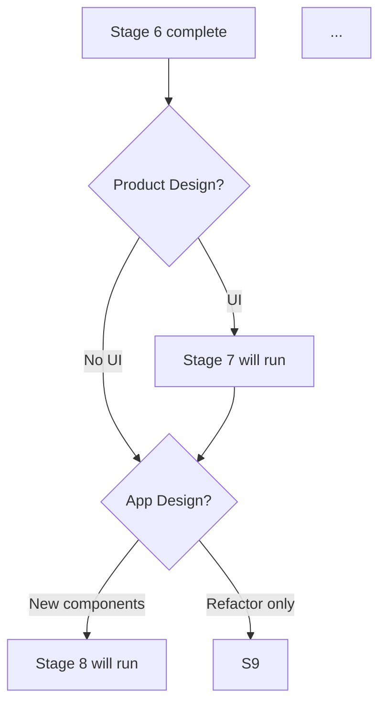

# Stage 6: Workflow Planning

**Owner:** PM · **Always runs** · **Approval required**

## Purpose

Decide which subsequent stages execute, at what depth, in what order.

## Execution

1. Load all prior Inception outputs.
2. Assess project shape:
   - User-facing? → Product Design needed
   - Multi-component? → Application Design needed
   - Multi-unit? → Units Generation needed
   - Per-unit NFR concerns? → NFR stages needed
3. Phase check: if `phase-discipline` extension enabled, flag anything outside active phase.
4. Generate workflow visualization:



5. Write `aidlc-docs/inception/plans/execution-plan.md`:

```markdown
# Execution Plan

## Active Stages

| Stage | Run? | Depth | Reason |
|---|---|---|---|
| 7. Product Design | Yes | Standard | UI involved (4 screens) |
| 8. Application Design | Yes | Standard | 3 new components |
| 9. Units Generation | Yes | Standard | 3 units planned |
| 10. Functional Design | Per-unit | Standard | Business logic per unit |
| 11. NFR Requirements | Per-unit | Minimal | Internal tool, basic perf only |
| 12. NFR Design | Per-unit | Minimal | Skip if Stage 11 minimal |
| 13. Infrastructure Design | Once | Standard | Shared infra across units |
| 14. Code Generation | Per-unit | Standard | All units |
| 15. Build | Once | Standard | Build all units |

## Skipped Stages
- (none in this plan)

## Phase Discipline
- Active phase: Phase 0
- All planned features in scope: ✓

## Estimated Timeline
[Optional — informational only, not committed dates]
```

6. Workflow Mermaid diagram embedded in execution-plan.md.

## Approval gate

```
Workflow Plan ready.
Stages to run: [count]
Stages skipped: [count]

→ Request Changes (adjust stages, depths)
→ Continue to next active stage
```

User can explicitly:
- Add a skipped stage back
- Skip a planned stage (with reason logged)
- Change depth
