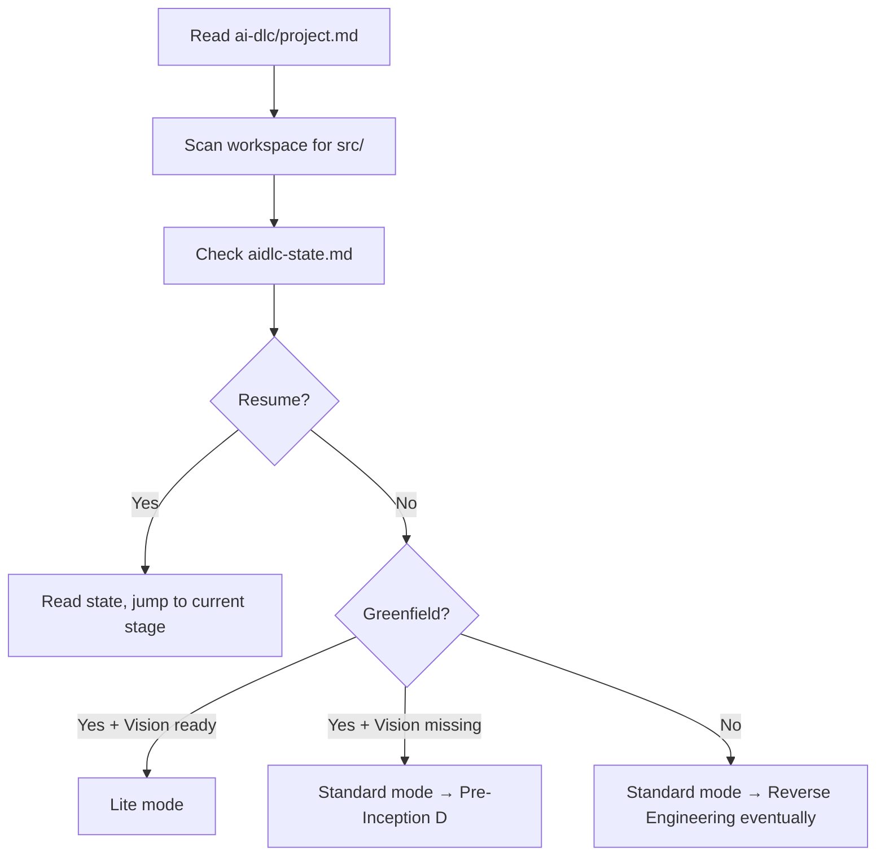

# Stage 1: Workspace Detection

**Owner:** AI agent · **Always runs** · **No approval gate**

## Purpose

Detect the workspace state and decide which mode (Lite/Standard) to use.

## Execution

## Steps

1. Read `ai-dlc/project.md`:
   - `project.name`
   - `project.source_of_truth` precedence order
   - `project.phase` if defined
2. Scan workspace root for:
   - `src/` or other code directories
   - `aidlc-state.md` (resume signal)
3. Scan `aidlc-docs/inception/discovery/`:
   - `vision.md` present?
   - `technical-environment.md` present?
4. Determine mode:
   - **Lite** = no code in `src/` AND both discovery docs exist
   - **Standard** = code exists OR docs missing
5. Determine type:
   - **Greenfield** = no code yet
   - **Brownfield** = code exists
6. Announce mode + type to user.
7. Initialize or update `aidlc-state.md`.
8. Log to `audit.md`.
9. Determine next stage:
   - If Standard + missing inputs → Pre-Inception routing
   - Otherwise → Stage 2 (KB Context Loading)

## Outputs

- `aidlc-docs/aidlc-state.md` (created or updated)
- `aidlc-docs/audit.md` (appended)
- Mode + type announced

## No approval gate

This is detection only — informational. User can override mode after announcement.
