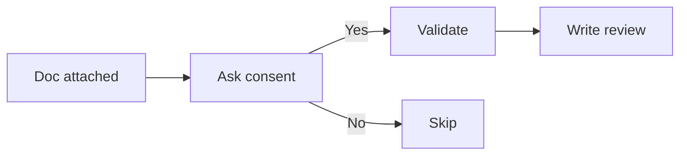

# Document Validator

**Purpose:** When user attaches a markdown doc, classify it, score against rubric, recommend sub-flow.

## Consent-first protocol



**Always ask first:**

```
I noticed `<filename>` was attached. Run validation on it?

  → Yes, validate
  → No, ignore the file
```

**Wait for explicit yes** before reading the document.

## Classification

After yes, classify the document as one of:
- **Vision Document** — what + why, scope, success metrics
- **BRD** — business requirements with detailed business case
- **PRD** — product requirements with feature-level detail
- **User-story pack** — INVEST-format stories with ACs
- **Mixed** — multiple types interleaved
- **Other** — doesn't match the above

Confidence score 0.0–1.0 based on:
- Section structure match
- Vocabulary match
- Length appropriateness for class

If confidence < 0.6: emit clarification questions to `<source>-questions.md`, pause.

## Rubric scoring

Each class has a rubric. Score each item Pass / Partial / Missing.

**Vision Document rubric (13 items):**
1. Problem statement
2. Target users / personas
3. Success metrics (measurable)
4. Scope IN
5. Scope OUT (explicit)
6. Constraints (regulatory, technical, business)
7. Dependencies on other systems
8. Risks
9. Assumptions
10. MVP Definition of Done
11. Out-of-scope features explicitly named
12. Stakeholders identified
13. Decision-makers identified

**BRD rubric, PRD rubric, etc.** — see individual rubric files.

## Vague-language flags

Flag and quote:
- "seamless", "intuitive", "user-friendly" without definitions
- "scalable", "performant", "robust" without numbers
- "enterprise-grade", "best-in-class" — marketing language
- "leverage", "synergy", "stakeholders agree" — corporate fluff

## Output: review file

Write to `aidlc-docs/inception/discovery/validation/<source>-review.md`:

```markdown
# Validation Report: <source filename>

## Classification
- Class: [BRD | PRD | Vision | Story-pack | Mixed | Other]
- Confidence: 0.XX
- Source path: [original location]

## Rubric Scoring (against [class] rubric)
| Item | Status | Notes |
|---|---|---|
| Problem statement | ✓ | Clear |
| Success metrics | ⚠ | "Should be fast" — not measurable |
| ... |

## Vague Language Flags
- Line 23: "seamless integration" — define what "seamless" means
- Line 67: "scalable architecture" — quantity? load profile?

## Cross-class Leakage
- This is classified as BRD but contains:
  - 4 user stories (belongs in story pack)
  - 2 technical decisions (belongs in Tech Env)

## Recommended Sub-flow
[A: skip | B: fill-gaps | C: map-existing | D: author-from-brief]
Reason: [1-2 sentences]
```

**Never modifies the source document.** Always produces sibling report.
