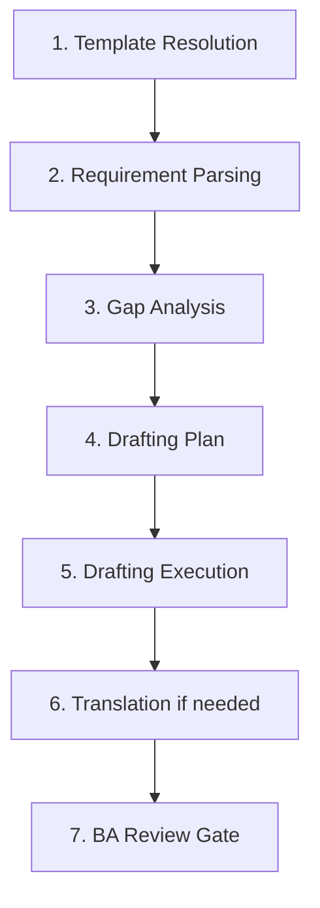

# Sub-flow D: author-from-brief

**Activates when** user has only intent or short brief.

## 7-step process



## Step 1: Template Resolution

Use `templates/00-pre-inception/vision.md` unless user references their own.

## Step 2: Requirement Parsing

From the brief, extract:
- Feature name
- Deliverable list
- Languages required (Vietnamese / English / both)
- Hints about users, scope, constraints

Log to `aidlc-docs/ba-authoring/<feature>/parsed-brief.md`.

## Step 3: Gap Analysis

Ask depth question:

```markdown
## Question: Drafting depth
A) Minimal — Vision + Tech Env, lean, MVP-focused
B) Standard — Vision + Tech Env + risk register + personas
C) Comprehensive — Vision + Tech Env + draft PRD(s) per feature (using `.kiro/templates/01-inception-requirements/pm/prd.md`) + risk register + personas. Draft PRD becomes input to Stage 4 PM finalization.
D) Other (describe below)

[Answer]: 
```

Then ask 3-5 critical gap questions tailored to the brief.

## Step 4: Drafting Plan

Write `aidlc-docs/ba-authoring/<feature>/plan.md`:

```markdown
# Drafting Plan: <feature>

## Sections to draft
- [ ] 1. Problem statement
- [ ] 2. Target users
- [ ] 3. Success metrics
- [ ] 4. Scope IN
- [ ] 5. Scope OUT
- [ ] 6. Constraints
- [ ] 7. Dependencies
- [ ] 8. Risks
- [ ] 9. Assumptions
- [ ] 10. MVP DoD
- [ ] 11. Out-of-scope features
- [ ] 12. Stakeholders
- [ ] 13. Decision-makers

## Dependencies
Section 1 (Problem) blocks all others.
Section 4 (Scope IN) blocks 5, 11.

## Estimated questions
~8 questions across sections 2-4.
```

User approves plan before drafting.

## Step 5: Drafting Execution

Section-by-section. After each section, tick the checkbox in plan.md.

Mini-completion messages after each section:

```
Section 1: Problem statement drafted.
→ Continue to Section 2
→ Revise Section 1
```

## Step 6: Translation (if multi-language)

Parallel drafting recommended. Write both versions in same session.

## Step 7: BA Review Gate

Full document review:

```
Vision Document drafted.
Sections: 13/13 ✓
Open questions remaining: 0

→ Continue to Inception
→ Revise sections (specify which)
```

If user requests revision, loop back only on named sections.

## Outputs

- `aidlc-docs/inception/discovery/vision.md`
- `aidlc-docs/inception/discovery/technical-environment.md`
- `aidlc-docs/ba-authoring/<feature>/plan.md`
- `aidlc-docs/ba-authoring/<feature>/parsed-brief.md`
- `aidlc-docs/ba-authoring/<feature>/audit.md`
- (Mode C only) `aidlc-docs/ba-authoring/<feature>/prd-draft.md` — feeds Stage 4 step 6a (PM finalizes into `aidlc-docs/inception/requirements/prd-<feature>.md`)
